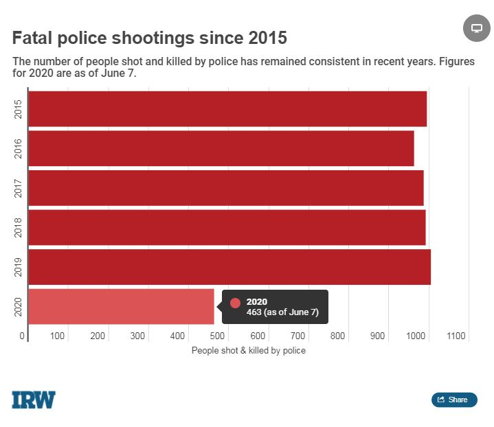
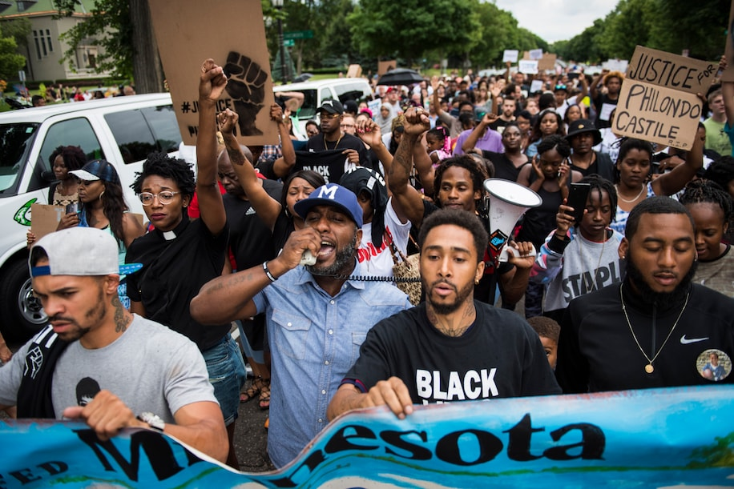

# Police Violence Against Marginalized Groups and Why it Happens: Police Violence

By: Jesse Ocampo (jsssth@uw.edu), Emm Ocampo (emmoc7@uw.edu), John Ocampo (ocampojo@uw.edu) 
INFO-201: Technical Foundations of Informatics - The Information School - University of Washington
WINTER 2022 

## Abstract:
Our main question is why police officers decide to fatally shoot civilians. We are interested in this question because while we are told that all lives are equal, that doesn't always seem to be the case. We hope to find a meaningful answer to this question by reviewing a dataset that has stored various shootings in America.

## Keywords:
Police shootings; Excessive force; Police reform

## 1. Introduction:
Considering the ever increasing debate between police and their use of excessive force, we found it incumbent upon ourselves to explore the reasons why police officers decide to fatality shoot civilians. This is particularly important to our group because, while we read the headlines and articles, we have never looked under the hood to study the data that forms the stories we hear seemingly of everyday. Our data comes from the Washington Post's Police Shooting Database, and it paints a dreadful consistency in the number of fatal shooting by police officers.  
  
Image from the Investigative Reporting Workshop. [(Berman, 2020)](https://investigativereportingworkshop.org/investigation/police-shoot-kill-nearly-1000-yearly/)[^1]  
As such, we plan to buckle down with this dataset and find an answer to our question. The dataset we plan to use contains information starting from January 2nd, 2015 and runs until August 16, 2020.

[(JohnM, 2021)](https://www.kaggle.com/jpmiller/police-violence-in-the-us?select=shootings_wash_post.csv)[^2]

## 2. Design Situation:
### Framing the topic of concern:
For this project proposal our group chose to laser in on a prominent and important social issue—police shootings in a five year time period. It is important to note that police shootings of ethnic minorities in the United States has long been a controversial issue at the national level because the rate at which ethnic minorities—especially black people—are shot by police is disproportionate according to the overall population.  
This topic is relevant and significant not only because justice system reforms have gained considerable traction in the public eye, but also because police training when it comes to the de-escalation tactics, routine stops, and normal public interactions between police and minorities has been heavily criticized over the last couple of decades. From a data scientist standpoint, the data on police shootings over our five years window might tell us why shootings of minorities have remained consisant despite claims of **increased training, increased police funding, and even increased accountability of police officers.**   
From a cultural and social standpoint, the United States as a whole has been dealing with police violence against minorities for decades, as Time Magazine states, the origin of the police force in the South was for the “preservation of the slavery system.” [(Maxman, 2017)](https://time.com/4779112/police-history-origins/)[^3] From an economic and governmental viewpoint we know that poorer neighborhoods, especially those where minorities tend to live, are more harshly policed than white or richer neighborhoods. [(Diep, 2019)](https://psmag.com/news/police-are-most-likely-to-use-deadly-force-in-poorer-more-highly-segregated-neighborhoods)[^4]

### Human Values:
While is possible to blanketly say that `police violence` and `racism` are connected at the hip, the overall picture is more complicated than just these two variables. We know this is the case because in more recent years, police violence—and especially police shootings—tend to be concentrated along the lines of social **economical** status. In other words, police shootings tend to happen more to marginalized and often poorer individuals. [(Diep, 2019)](https://psmag.com/news/police-are-most-likely-to-use-deadly-force-in-poorer-more-highly-segregated-neighborhoods)[^4]

### Stakeholders:
In this domain of interest, one could say that there are many different direct stakeholders, however, it is important to acknowledge that the people who are mainly affected by police shootings and police violence are ethnic minorities and other marginalized groups: such as black people, Hispanics, the homeless, and immigrants. We make this distinction because minorities often don’t have the same avenues of power that dominant white groups of people do.  

Speaking from an indirect standpoint, minority groups are also often the indirect stakeholders for the results of laws and reforms that happen to the police reform. Sadly, most members of minority groups are often living paycheck to paycheck and don't have the time nor means to fight against police brutality until it happens to them or someone they know. Thankfully, many organizations are currently fighting to speak for those who don't have a voice. [(PE, 2020)](https://policingequity.org/what-we-do/national-justice-database)[^5]    

### Benefits and Harms:
The clearest harm of collecting this type of data is the stereotyping of victims to be a certain race or skin color. Bad actors could point to the data and make unsubstantiated claims, such as minorities are just simply more violent than white people. Similarly, people using this type of data in bad faith may take to blaming mental disabilities as the sole reason why police officers were "forced" to use excessive force. Thereby pushing the problem outside of what the police can do.

The benefits to collecting this data are also clear, federal and local governments can take it to take the necessary steps to reform our current police system. While some proposals for reform focus on ideas such as increased training and the incorporation of other de-escalation tactics, the American Bar Association (ABA) is pushing for police accountability. The ABA points toward the `Law Enforcement Officers’ Bill of Rights` as requiring police to only **investigate themselves** and then they are in **full control of disciplining officers who engage in misconduct.** [(Love, 2021)](https://www.americanbar.org/groups/crsj/publications/human_rights_magazine_home/civil-rights-reimagining-policing/police-accountability/)[^6]  

## 3. Research questions:
1. _**Who are the people most affected by police shootings?**_
2. _**Why might it happen more to one specific group over another?**_
3. _**Where do police shootings take place the most?**_

We were lucky to find a great dataset for our project to answer these questions. First, to answer the question of who exactly are the people most affected by police shootings, we will analyze the data about police shootings and the people involved in them. Second, we will answer our second research question by attempting to look for clues as to why the shootings happened and where exactly they occurred to try and find a meaningful link between a place and a reason. Lastly, in order to answer our last research question, we will arrange the police shooting data according to location in order to obtain a good idea of where police shootings occur the most.

## 4. The Dataset:
In the dataset that we focusing on, extensive data of police shootings information and the victims of those police shooting (as well as other factors) were clearly presented in the CSV file. In the file we can observe police shooting victims by their name and the date in which they were shot. Some of the many variables we can look at are the race and gender of the victims, the age and even the location in which they were shot.  

The dataset we decided to base the project on is provided by the Kaggle organization, from a user named "JohnM". They titled the dataset `Police Violence & Racial Equity - Part 1 of 3.` This data was collected in an effort to visualize the amount of people who had been shot by police during a five year time window. It is important to note that the original data itself was provided by the Washington Post and their investigation since January 2015 on fatal police shootings. The way in which the data is validated is by pulling the data from a separate database; the `Washington Post's Police Shooting Database.` [(Link to their GitHub repository)](https://github.com/washingtonpost/data-police-shootings)[^7] The data is then organized by JohnM on Kaggle and contains 10 observations and a total of 6,045 features. We hope that a dataset of this size will allow us to answer all of our research questions with sufficient accuracy.

Now the way in which Washington Post itself collects data on police shootings is by “culling local news reports, law enforcement websites and social media, and by monitoring independent databases such as Killed by Police and Fatal Encounters,” they also further explain that, “The Post conducted additional reporting in many cases.” The data comes directly from Washington Post's extensive analysis on fatal police shootings and all relevant datasets will be of course credited to the original source.[^7]

## 5. Expected implications:
While we think that the research questions that we are trying to answer in this project proposal are not overly complicated, or overly narrow, we have noted that simply having answers to these questions, to a provable and credible degree, would give us a significant headway in the road to social justice and perhaps even possible future reforms.

However, while we acknowledge that reputable organizations such as the New York Times, the Washington Post and others have been reporting on significant police violence against minorities for numerous years, it hasn’t been until recently that concrete action to combat these injustices has been demanded by the general public. In reality, easy to read data that could show police violence against minorities and other marginalized groups by the numbers would be a useful tool to show legislators, local governments and other police organizations in order to improve the relationship between law enforcement and the affected groups. At the end of the day, we simply want to answer who are the groups most deeply affected by police violence and the possible reasons as to why these groups **specifically** suffer the most.

## 6. Limitations:
While credible news organizations and other trustworthy nonprofits make every effort to corroborate all the leads they may receive in regards to police violence, police shootings, and other fatal encounters, it is important to recognize that it is impossible for all of these leads to be 100% accurate. This is true no matter how many safety nets these organizations put in place.

One possible solution to this very serious limitation would be to cross reference the data that we are analyzing from one organization against the data of another equally reputable organization. However, because of the sheer amount of data we are analyzing it would be difficult if not outright impossible, at least in the allotted time, to verify that all fatal shootings listed in the data have complete and accurate information associated with each case. The data by the Washington Post, for example, shows fatal police shootings but also relevant information regarding these shootings such as whether or not the suspect was armed and whether or not they died that same day. While it is very likely that all of this information is accurate given the fact that all the data is continuously updated, it is also possible that some of this relevant information associated with each shooting may have changed. Furthermore, we question if the very nature of our research questions and our data will lead us down the path of correlation rather than causation.

## Acknowledgement:
We would like to thank our Professor David G. Hendry for giving us an ~~excuse~~ opportunity to research a topic we are deeply invested in. Our Teaching Assistant, Shawon Sarkar for ~~putting up with~~ thoughtfully answering questions we've asked her; and a special shout-out to Thomas J. Wilson for all the help he provided on Teams. :hugs:

### Appendix A: Questions:
Are our research questions satisfactory, or could we make improvements?

## References:
[^1]: Berman, et al. (2020, June 8). _Police Shoot, Kill Nearly 1,000 Yearly._ The Investigative Reporting Workshop. https://investigativereportingworkshop.org/investigation/police-shoot-kill-nearly-1000-yearly/  
[^2]: M, John. (2021). _Police Violence & Racial Equity - Part 1 of 3._ Kaggle. https://www.kaggle.com/jpmiller/police-violence-in-the-us?select=shootings_wash_post.csv  
[^3]: Maxman, Olivia. (2017, May 18). _How the U.S. Got Its Police Force._ Time Magazine. https://time.com/4779112/police-history-origins/  
[^4]: Diep, Francie. (2019, Jan 24). _Police Are Most Likely to Use Deadly Force in Poorer, More Highly Segregated Neighborhoods._ Pacific Standard. https://psmag.com/news/police-are-most-likely-to-use-deadly-force-in-poorer-more-highly-segregated-neighborhoods  
[^5]: PE. (2020). _National Justice Database._ Center For Policing Equity. https://policingequity.org/what-we-do/national-justice-database  
[^6]: Love, Dayvon. (Jan 11, 2021). _Police Accountability._ American Bar Association. https://www.americanbar.org/groups/crsj/publications/human_rights_magazine_home/civil-rights-reimagining-policing/police-accountability/  
[^7]: NA. (2015). _Police Shooting Database._ The Washington Post. https://github.com/washingtonpost/data-police-shootings
